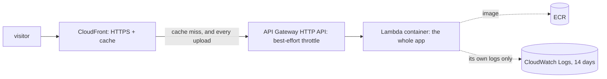

# Putting it on the internet

**Status: deployed and working, 2026-10-03; redesigned page and the retry map shipped 2026-10-04** (Terraform in `infra/`, us-east-1; 13 resources, nothing of Winnow touched). The first live checks found two problems, described under "What the first live checks found":

| What | State |
|---|---|
| The public address through CloudFront (`terraform output url`) | **20 of 20 checks pass**, and the real page analyzes the sample traces in a browser. It first answered 403 to everything; fixed the same day |
| The app called through API Gateway directly (`terraform output api_endpoint`) | 18 of 18 checks pass (the 2 CloudFront-only checks are skipped) |
| Protection for Winnow's Lambda slots | **Not in place yet.** The API throttle is best effort, and a cap needs the account quota raised first (an AWS Support case, below). Keep the address unlisted until then |

## The design



- **One container serves the page and the API**, so they deploy together and can never be out of step.
- **CloudFront** gives HTTPS and caches the page, scripts, samples and the chart data for 5 minutes (the app marks them `s-maxage=300`). **Analysis results are `no-store`**: nothing may keep a copy of someone's report.
- **API Gateway** has a throttle (2 per second, bursts of 5). It is a best-effort target, not a ceiling: see below.
- **Lambda** runs the app. Its IAM role can write its own logs and nothing else: no storage, no database, no other AWS service.
- **Nothing is stored.** No bucket, no database. Jev (a third-party call) is not enabled in the hosted version, so "your traces never leave" stays literally true.

## Why this and not the alternatives

| Option | Verdict |
|---|---|
| AWS App Runner | **Closed to new customers since April 30, 2026** ([InfoQ](https://www.infoq.com/news/2026/04/aws-deprecates-workmail-apprunne/)). An earlier version of this document recommended it; that was stale. |
| ECS Express Mode / Fargate behind a load balancer | AWS's recommended replacement ([announcement](https://aws.amazon.com/about-aws/whats-new/2025/11/announcing-amazon-ecs-express-mode/)). Works well, but the load balancer and an always-on task are a standing monthly cost, many times the $5 monthly budget, for a stateless tool that mostly idles. |
| Lambda behind API Gateway and CloudFront (chosen) | Scales to zero, so cost follows use. Matches the product: short, stateless, CPU-light requests. |

Cost, as I understand current AWS pricing (not re-verified on the day you apply, so check it): Lambda's always-free tier is 1M requests and 400,000 GB-seconds a month; CloudFront's is 1 TB and 10M requests; API Gateway HTTP APIs are about $1 per million requests; ECR storage for one ~200 MB image is cents. Expect well under a dollar a month at low traffic. Your existing account-wide **$5/month budget** (alert at 80% actual and 100% forecast) already covers this: it has no filters.

## Trade-offs, plainly
- **Uploads are limited to 5 MB** in the hosted version, because Lambda cannot take a request body above 6 MB. Local and Docker runs allow 15 MB. A larger-trace path (S3 upload, queue, worker) is a later version, and it would change "never stored" to "deleted within a day".
- **This account allows only 10 concurrent Lambda executions in total**, shared with `winnow-api`. A function cannot reserve concurrency from a pool that small. The first version of this document said the API throttle protects Winnow. **That was wrong** (measured below): a flood against this stack can use all 10 slots and starve Winnow.
- **No per-visitor rate limit.** API Gateway's throttle is global, so during a flood legitimate visitors also see "too many requests". The cost stays bounded, but availability does not. A per-address limit needs AWS WAF (a few dollars a month): add it if the product gets real traffic.
- **Deploying uses an AWS profile that has AdministratorAccess.** Fine for a first deploy you approve line by line. The better long-term way is a role limited to this stack, assumed by GitHub Actions through OIDC, with no long-lived keys in CI.
- **Terraform state is a local file** (`infra/terraform.tfstate`, git-ignored). Fine for one person; a team would use a locked remote state.

## How to deploy and undo

```powershell
cd infra
.\.bin\terraform.exe plan -var image_tag=x      # read what will happen
.\deploy.ps1                                    # Terraform asks you to type "yes" before each change
.\.bin\terraform.exe destroy -var image_tag=x   # removes what Terraform created here, nothing else
```

**Shipping a change** (a new page, a fix): read what Terraform would do, then run the script.

```powershell
.\.bin\terraform.exe plan -var image_tag=probe   # must say "1 to change": the Lambda's image_uri, nothing else
.\deploy.ps1 -AutoApprove                        # build, push, apply, smoke test, clear the CloudFront cache
python verify_live.py <address>                  # 20 checks through the public address
```

Why the cache is cleared: CloudFront keeps the page, scripts and styles for 5 minutes (`s-maxage=300`) and each file expires on its own clock, so right after a deploy a visitor could get the new HTML with the old JavaScript. Rolling back is the same command with the previous tag: `.\.bin\terraform.exe apply -var image_tag=<previous tag>` (ECR keeps the last 5 images), then clear the cache again.

`deploy.ps1` creates the registry, builds and pushes the Lambda image (`--provenance=false`, because Lambda cannot read the attestation manifests Docker adds by default), creates the rest, then health-checks the public address. Image tags are immutable, so every deploy gets a new one and an old version is always one tag away.

## Checking it

```powershell
python infra\verify_live.py <address>      # 20 checks (18 when pointed at API Gateway), one request at a time, about 30 seconds
```

It asserts what a stranger would meet: the page and its security headers, a 5-minute shared cache, the sample trace giving the same answer as the local run, garbage and oversize input refused without repeating it, no API docs, no CORS, and (behind CloudFront) a cache hit on the second request and an http-to-https redirect. There is no flood test, on purpose (see 2 below). `docker diff` has no equivalent here; "nothing is stored" rests on the Lambda role being allowed to write its own logs and nothing else.

## What the first live checks found

**1. CloudFront answered 403 to everything, and the app itself was fine.** Calling API Gateway directly returned 200. The same request with only the `Host` header changed to CloudFront's domain returned 403; five other headers CloudFront adds (`Via`, `X-Amz-Cf-Id`, `X-Forwarded-For`, `CloudFront-Forwarded-Proto`, `User-Agent`) did not. The cause was the cache policy: AWS's managed `UseOriginCacheControlHeaders` has `host` in its cache key, and anything in the cache key is also sent to the origin, so the origin request policy that removes `Host` never got to matter. Fixed with a custom cache policy that follows the app's own `Cache-Control`, capped at 5 minutes, with nothing in the key (applied: 1 added, 1 changed, 0 destroyed). Afterwards 19 of 19 checks pass, the second request for the page is a CloudFront cache hit, and `terraform plan` reports no differences.

**2. API Gateway's throttle did not hold, and the 10-slot Lambda pool is shared with Winnow.** Twenty requests at once to `/healthz`: 15 served, 5 rejected by Lambda (shown as 503), **none turned away by the throttle**. CloudWatch for that minute: Lambda concurrency reached 10 (the whole account), 5 Lambda throttles, and no invocations or throttles for `winnow-api`. So no harm that time, but a sustained flood could starve Winnow. Cost is capped by the same limit rather than by the $5 budget, which only sends email: ten busy 512 MB slots for a whole day is about 432,000 GB-seconds, roughly $7 at the list price beyond the free tier (my arithmetic, not re-checked), plus API Gateway's per-request charge.

What would fix it, in order:
- **(a) Raise the account's Lambda concurrency quota, then cap this function.** AWS refuses any reservation that would leave fewer than 10 slots unreserved, and the account has exactly 10, so the cap cannot be set today. The Service Quotas API also refused a request for 100 ("must be greater than the default quota value of 1000": this account is set *below* AWS's default). The route left is an AWS Support case from the console (Support Center, Create case, Service limit increase, Lambda, us-east-1, Concurrent executions; the CLI cannot file it on the free support plan, and I have not verified from here that the free plan accepts this case type). Once the quota is raised: `terraform apply -var image_tag=<current> -var lambda_reserved_concurrency=3`. The variable already exists and defaults to no cap. The cap becomes real and the rest stays Winnow's.
- **(b)** A per-visitor limit needs AWS WAF, a few dollars a month.
- **(c)** Until (a) is done, do not list the address anywhere.
