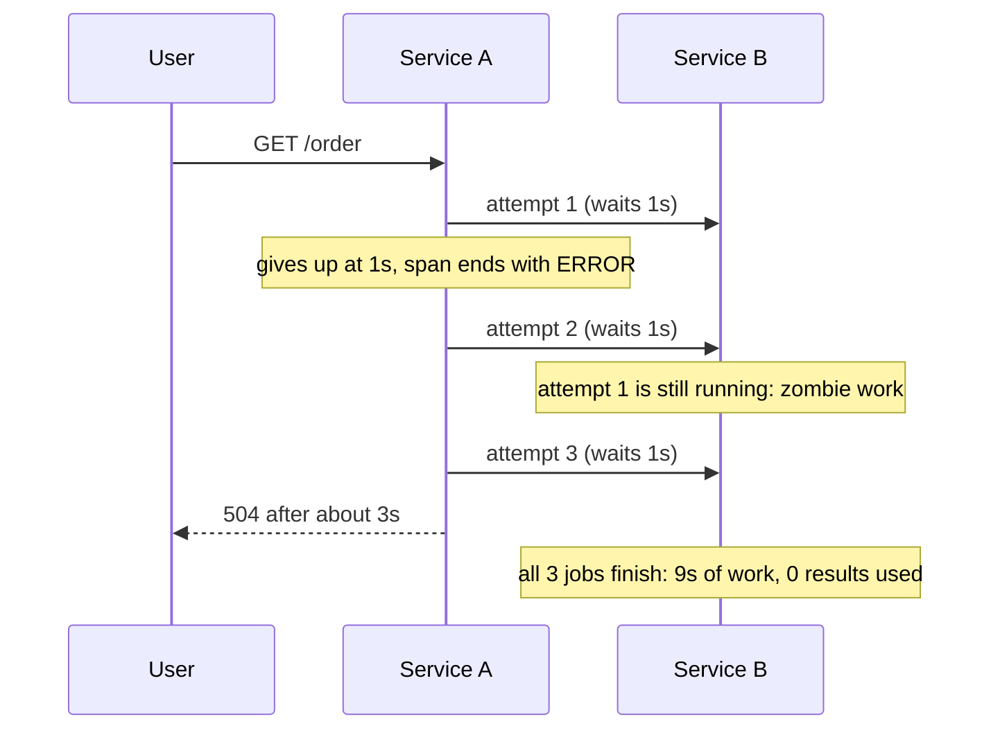
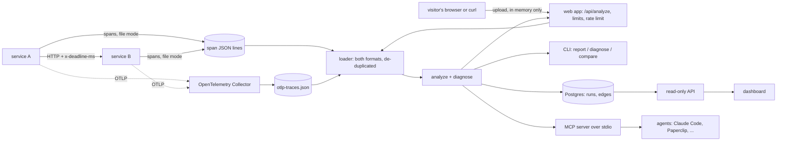

# overload-xray: design notes

## The problem in one picture

A user request reaches service A. A calls service B and waits at most 1 second per attempt, retrying twice. B needs 3 seconds, and nothing tells B that A has left.

With deadline propagation, A sends the time it is still willing to wait (`x-deadline-ms`, remaining milliseconds). B cancels the job when that time passes: the same user outcome, but B does about 2.9s of work instead of 9s.

## Architecture

## Definitions

| term | meaning |
|---|---|
| amplification | calls made to a dependency per user request (per edge: fan-out per hop, reach per user request) |
| goodput | share of the callee's running time whose result the caller used |
| zombie work | work by jobs that outlived a caller who had already given up |
| zombie tail | the part of that work done after the caller left, which cancelling would save |

## Decisions

**D1. What counts as zombie work (`zombie_tail_ns`).** Three things must hold: the caller gave up (its span ended in ERROR and the error is not a reply from the callee), the callee kept *running* after that moment, and the difference is larger than a clock tolerance (5 ms). A callee that outlives a *successful* call is background work, not zombie work.

**D2. Running time, not waiting time.** A job queued behind others uses no capacity. Services set `app.queue_wait_ms`, and xray counts only the time after it. Without this the first load test counted queue time as work and its numbers were wrong.

**D3. Relative deadlines.** The header carries remaining milliseconds, not a clock time, because two machines' clocks disagree (the same reason D1 has a tolerance). The sender subtracts 50 ms so that the callee's "too late" reply beats the caller's own timeout.

**D4. Cancelling is not enough.** Measured in the load test: cancelling at the deadline removes the zombie tail but users still fail. With a first-in-first-out queue under overload, the job at the front has already used most of its time, starts, cannot finish, and is cancelled midway. The fix that worked is refusing jobs that cannot finish in the time left ("shed").

**D5. De-duplicate spans on load.** OTLP delivery is at-least-once, so the same span can arrive twice. A span is identified by trace id and span id.

**D6. Postgres schema.** Durations are nanoseconds in `bigint`. CHECK constraints keep the numbers consistent (used and zombie work are parts of the total; the tail is part of zombie). A run and its edges are saved in one transaction. Goodput is derived when read, never stored. `UNIQUE (run_id, caller, callee)` gives one row per edge and the index for "all edges of a run". The API is read-only: runs are written by the CLI.

**D7. Jev has exactly one job.** A caller's span ending in ERROR does not prove the caller left (the callee may have replied with an error). Rules decide the clear cases: an HTTP status means the callee replied; words like "timeout" mean the caller left. Jev is asked only about error text the rules cannot place. It is opt-in (`--jev`), it sees only scrubbed text (URLs, emails and long tokens removed, 200 characters at most), a low-confidence answer stays "unknown", any SDK failure becomes "unknown", and "unknown" counts as "gave up" (the old assumption) and is tallied in the report. *Verified:* the SDK's types and error behaviour, with tests that use its real response objects. *Not verified:* a live call, because that needs an API key.

**D8. Agent interfaces.** Agents get an MCP server over stdio plus a `SKILL.md`. Paperclip's README lists "your own MCP server" connectors and shared skills, which is why this is the integration. The server only reads files inside `XRAY_ROOT` (it resolves the real path, so `..`, absolute paths and symlinks are refused), caps input size, never writes, and opens no network connection unless `use_jev` is set. Anticipated failures use `ToolError` so the agent sees the reason; unexpected crashes stay generic. *Not verified:* running inside Paperclip itself. *Dots* (OpenAI's always-on coworkers): no integration surface could be verified, so none is claimed.

## The product (upload, report, nothing kept)

**D9. In memory only, and the container enforces it.** The upload is parsed and analyzed in memory and dropped. The `web` container runs with a read-only root filesystem, a non-root user and no Linux capabilities; after uploading a trace, `docker diff` shows no changed files. If the app ever tried to store a trace, it would crash instead of doing it quietly.

**D10. JSON body, not multipart.** Multipart parsers typically spool large uploads to temporary files, which would break D9. The page sends `{"files": [{"name", "text"}]}`; `curl --data-binary` can send the raw file. The body is read in chunks and refused as soon as it passes 15 MB, not after buffering it.

**D11. Hostile input is the normal case.** Limits on files (10), bytes (15 MB) and spans (100,000); a per-address rate limit (20 a minute, memory-bounded, and it reads the proxy-appended end of `X-Forwarded-For` only when told it is behind a trusted proxy, because the start of that header is written by the client). Error messages name the file and line and the kind of problem, never the contents. A trace whose ancestor spans formed a cycle made the first version loop forever; the ancestor walk now tracks what it has seen, the verdict calculation is iterative, and regression tests fail if the analyzer ever hangs.

**D12. Safe rendering.** Service names inside an uploaded file are attacker-controlled text. The page builds elements with text nodes only (never HTML strings), and the content-security policy allows scripts only from the site's own origin. Checked in a browser with service names that were `` and `<script>` payloads: shown as literal text, nothing executed.

**D13. The page should look like a company made it.** The first version was a single-column tool page, which is what people expect from a weekend project. The redesign borrows *structure and attitude* from sites trending on GitHub in October 2026, not their code or branding: [effect.website](https://effect.website) for the order (one-line promise, then the thing to try, then proof, then a worked example, then trust) and its engineered look (hairline grid, monospace micro-labels), and [impeccable.style](https://impeccable.style) for pointing callouts at a real artifact. Rules that kept it honest: every number on the page is read from the same data as the chart or drawn from the bundled sample's real timings (3 attempts, 9.0 s of work, 6.0 s after the callers left); no logos or "used by" claims, because there are no users yet; the load test is labelled synthetic on the page; system fonts only, because the content-security policy allows no external fonts; and `tests/test_static_page.py` fails if the page starts to depend on another origin, an inline script, or an element id the script no longer finds. A link like `/#sample=retry-storm` opens the page with that sample already analyzed, so a result can be shared.

**D14. A retry is a pattern, so the rule is written down and tested** (`xray/retries.py`, `tests/test_retries.py`). Spans carry no "this is a retry" flag, so xray groups CLIENT spans started by the same job for the same call (same method and URL host, port and path; or, with no URL, the same endpoint of the same callee). A later attempt continues the chain only when it started after the previous one ended **and the previous one failed** (error status, 5xx, 408 or 429), or when the client library marks it itself (`http.request.resend_count`). Everything else is a new call: a loop of successful calls is fan-out, overlapping requests are hedging, and a different path is a different call. What stays wrong on purpose: a program that deliberately repeats a failing call looks like a retry (the page says "inferred"), and client calls with neither a URL nor a callee are counted, not guessed. "Layers" counts retried calls on the way down; "multiplication" counts the attempts that reached the deepest edge under one top call (counted from the spans, not multiplied), so it is close to Uber's "retry storm radius" but not the same measurement. URLs are reduced to host, port and path when spans are loaded (credentials, query strings and fragments can hold secrets), and routes in the retried-writes list have ids replaced. Not seen: retries inside one span (a library that loops internally), sidecar or mesh retries that leave no spans, and attempts the sampler dropped.

**D15. Wasted LLM tokens are an estimate, and the report says so** (`xray/analyze.py`). Tokens are read from `gen_ai.usage.input_tokens`/`output_tokens` (and the older `prompt_tokens`/`completion_tokens`); a non-number is ignored, not guessed. A token counts as wasted in exactly two cases: it was spent inside a called job whose caller gave up (the job's verdict is "unused"), or it was spent by a client call that never delivered an answer (the span errored, got a 5xx, 408 or 429, or was a discarded attempt in a retry chain). A used root request's own tokens are kept: the answer was consumed. Whether a cancelled call really stops billing depends on the provider, so no one can invoice these numbers; `xray report --input-token-price / --output-token-price` turns them into a dollar estimate that is explicitly labelled "an estimate".

**D16. A report can be a build gate (`xray report --min-goodput / --max-amplification`).** The report is always printed first, so a failing CI log still shows the numbers; then one `FAIL:` line per broken limit, and the process exits 1 (nothing above `main()` in `xray/__main__.py` catches `SystemExit`). The GitHub Action keeps that contract: the gate step captures its own exit code explicitly (GitHub's `bash -e` would otherwise stop the script before the verdict is recorded), a later step turns that verdict into the job's exit code, and the baseline diff step runs in between so the pull request comment is posted whether the gate passed or not. The comment shows `xray compare` output, because a number alone does not say what regressed.

## Gotchas found while building

- **FastAPI 0.14x auto-configures OpenTelemetry.** When `OTEL_EXPORTER_OTLP_ENDPOINT` is set it adds its own OTLP exporter at startup, so a service that already exports would send every span twice. Found by comparing what each service sent with what the receiver got. Fixed with `FastAPI(telemetry={"auto_configure": False, ...})`, and guarded by `tests/test_services.py`.
- **The first load test overstated its numbers.** Successes that arrived after the arrival window closed were divided by the window length, so "shed" appeared to exceed B's physical capacity. The metric now counts only successes that finished inside the window.
- **An HTTP error is not a timeout.** Client spans for 503 replies carry `http.status_code`; timeouts carry only an error description. Treating both as "the caller gave up" produced false zombie work.
- **A managed CloudFront policy is not what its name says.** `UseOriginCacheControlHeaders` has `host` (plus `origin`, two method-override headers and every cookie) in its cache key, and whatever is in the cache key is also *sent to the origin*, whatever the origin request policy says. So API Gateway received CloudFront's own domain as `Host` and answered 403 to everything. The policy IDs had been "verified" by name only. Found by calling API Gateway directly with that one header changed (200 became 403), then reading the policy's contents with the CLI. Fix: a custom cache policy with nothing in the key.
- **API Gateway's throttle is a target, not a limit.** Set to 2 requests a second with bursts of 5, it let all 20 of 20 simultaneous requests through (no 429 at all). They used all 10 of the account's Lambda slots and Lambda rejected 5 (API Gateway reports that as 503). Those 10 slots are shared with `winnow-api`, so a flood against this stack could starve Winnow; CloudWatch showed no Winnow invocations or throttles during the test. The real fix is to ask AWS to raise the account's concurrency quota and then reserve a few slots for this function. Until then the stack stays unlisted. `infra/verify_live.py` has no flood test on purpose.
- **Windows PowerShell 5.1 traps in `deploy.ps1`.** `$x = if (...) { @("-flag") } else { @() }` returns a bare string, and splatting a string passes it one character per argument (Terraform: "Too many command line arguments"); write `@(if (...) { "-flag" })`. Piping `aws ecr get-login-password` into `docker login --password-stdin` fails with 400 (stray bytes); go through `cmd /c`. `$ErrorActionPreference = "Stop"` does not stop on a failing `.exe`; check `$LASTEXITCODE` after each step. The opposite trap: docker prints its build progress on stderr, and when output is captured (a log file, CI) PowerShell 5.1 turns each stderr line into an error record, so "Stop" aborted the script on docker's first progress line although the build had not failed. It appeared only on the second deploy run, because the first image was built by hand. Fix: run each step with "Continue", turn the lines back into text, and trust the exit code. Reproduced in a scratch script before fixing: a chatty program that succeeds survives, one that exits non-zero still stops the script.

## What is and is not proven

Proven here: the maths on hand-built traces (the README example), the loader on real SDK output and on OTLP/JSON, the Postgres layer against a real Postgres 16, the services through Docker with a real OpenTelemetry Collector, the MCP server over stdio, the load-test effect on one machine, and the deployed Lambda over HTTPS (`infra/verify_live.py`: 20 of 20 checks through the public address, including the same answer as the local run for the sample trace and a CloudFront cache hit), and the real page in a browser analyzing the sample through CloudFront.

Not proven, and said plainly:
- The services are synthetic (they sleep). No real application has been measured yet.
- Each load-test point is one run with one random arrival sequence per rate. There are no confidence intervals.
- Service time is fixed at 0.5s; real service times vary.
- "Shed" knows the job's duration up front. A real service would estimate it.
- Nothing stops a flood from using the account's shared Lambda slots (above): the cap exists in Terraform (`lambda_reserved_concurrency`) but cannot be set until AWS raises the account's quota. Per-visitor limits would need WAF.
- Kubernetes, the Go rewrite and GraphQL are not built.
